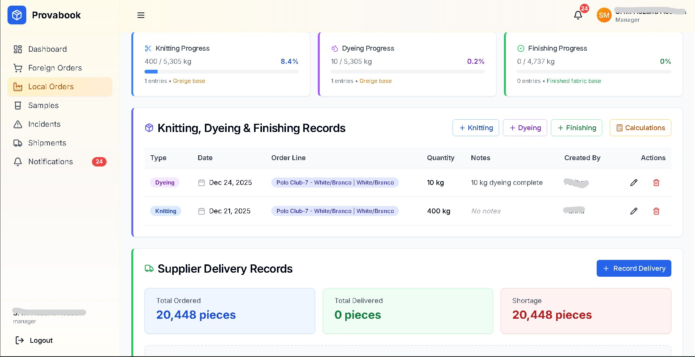
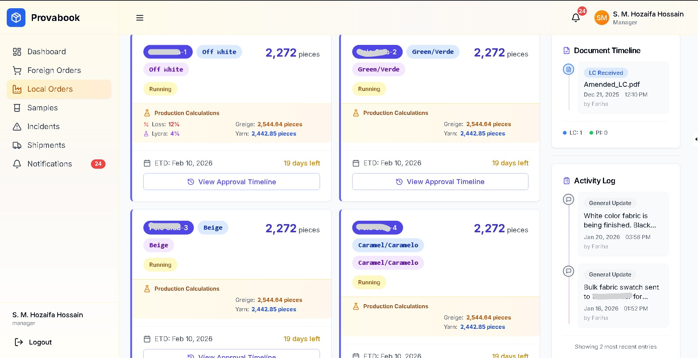

# Provabook – Production Control for the Modern Buying House

**Stop chasing updates. Start controlling production.**

Provabook is the operating system for textile buying houses and mills who are tired of managing million-dollar orders on WhatsApp and Excel. It replaces chaos with a single source of truth, giving you visibility from inquiry to shipment.

---

## 🛑 The 4 Problems That Kill Profits
If you run a buying house or factory, you know this cycle:

1. **Last-Moment Shipment Pressure** 🚨
   - You find out about delays 2 days before shipment.
   - Result: Air freight costs, discounts, and angry buyers.

2. **The "Excel & WhatsApp" Black Hole** 🕳️
   - Critical updates are buried in chat logs or outdated spreadsheets.
   - Result: "I didn't see that message" becomes the excuse for $10,000 mistakes.

3. **Merchandiser Dependency** 🔑
   - If your key merchandiser gets sick or quits, the order history vanishes with them.
   - Result: You are held hostage by your staff's memory.

4. **Blind Inspection & Payment** 💸
   - You pay suppliers or factories without knowing if the goods are actually ready or up to spec.
   - Result: You pay for quality you didn't get.

---

## ✅ How Provabook Solves It

### 1. The "Live" Production Cockpit
Forget asking "what's the status?" 50 times a day.
- **Real-Time Progress Bars:** See exactly how much fabric is knitted, dyed, and finished vs. the order quantity.
- **Automatic Calculations:** We track **Process Loss** and **Finished Fabric** usage automatically. If a line is bleeding fabric, you see it instantly in the progress metrics.
- **Daily Targets:** Managers see daily output vs. required output to hit ETD.

### 2. The Activity Log (No More "He Said, She Said")
Every action is recorded in a permanent, un-editable timeline.
- **Who** changed the quantity?
- **When** was the artwork approved?
- **Why** was the lap dip rejected?
- **Evidence:** The system logs every change, upload, and approval. Accountability is built-in.

### 3. Centralized "Brain" for Every Order
- **Document Stack:** Tech packs, POs, LCs, and invoices live *with* the order, not in email folders.
- **Visual Timelines:** See the entire story of an order—from the first inquiry to the final packing list—in one visual stream.
- **Team Continuity:** Any team member can step in and see exactly where an order stands. The knowledge belongs to the company, not the person.

---

## 🖼️ Screens & Visuals

| Dashboard & Navigation | Sample Orders | Notifications |
| --- | --- | --- |
|  |  |  |

---

## 🚀 Recent Power-Ups (Latest Updates)

We don't just maintain; we evolve. Here is what we deployed this week to give you tighter control:

- **📉 Precision Loss Tracking:** New algorithms now calculate **Process Loss %** and **Mixed Fabric** usage automatically. You can now see exactly how much raw material is being wasted per order.
- **📊 True-Finish Progress Bars:** Production progress is now calculated against *Finished Fabric* targets, giving you a brutally honest view of how close you actually are to shipment.
- **📜 The "Mega-Timeline":** A revamped Activity Log and Document Timeline that sits right in your order details. It aggregates every document, note, and status change into a single chronological feed.
- **⚡ Local Order Intelligence:** We overhauled the local production order fields to support granular tracking of greige, yarn, and finishing stages independently.

| Precision Loss Tracking | Production Progress | The "Mega-Timeline" |
| --- | --- | --- |
|  |  |  |

---

## 🛠️ For The Tech Team (Architecture & Setup)

### Tech Stack
- **Frontend:** Next.js 14 (App Router), TypeScript, Tailwind CSS, shadcn/ui.
- **Backend:** Django 5 (Python), Django REST Framework, PostgreSQL.
- **Infrastructure:** DigitalOcean, Google Cloud Storage (for secure docs).

### Quick Start (Developers)

**Django Backend**
```powershell
cd backend_django
python -m venv venv
.\venv\Scripts\activate
pip install -r requirements.txt
python manage.py runserver
```

**Next.js Frontend**
```powershell
cd frontend
npm install
npm run dev
```

### Documentation Map
- **`backend_django/README.md`**: API specs and commands.
- **`frontend/README.md`**: UI components and state management.
- **`IMPLEMENTATION_GUIDE.md`**: Detailed workflows.
